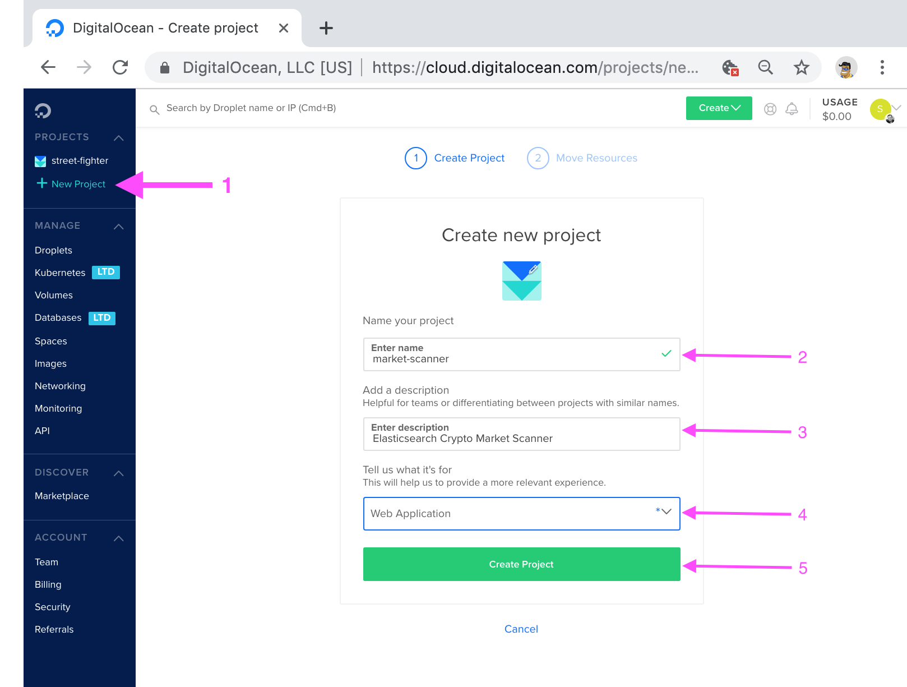
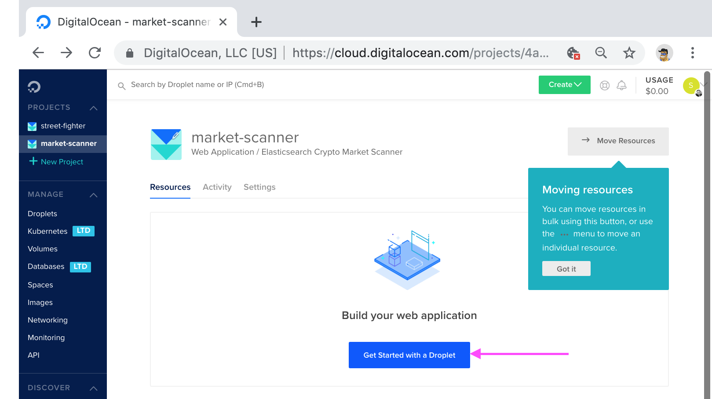
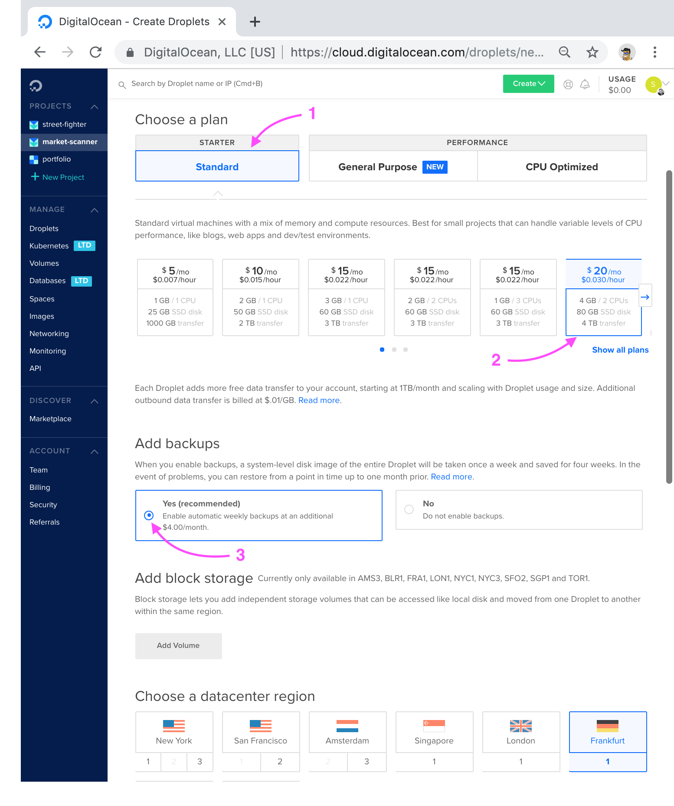
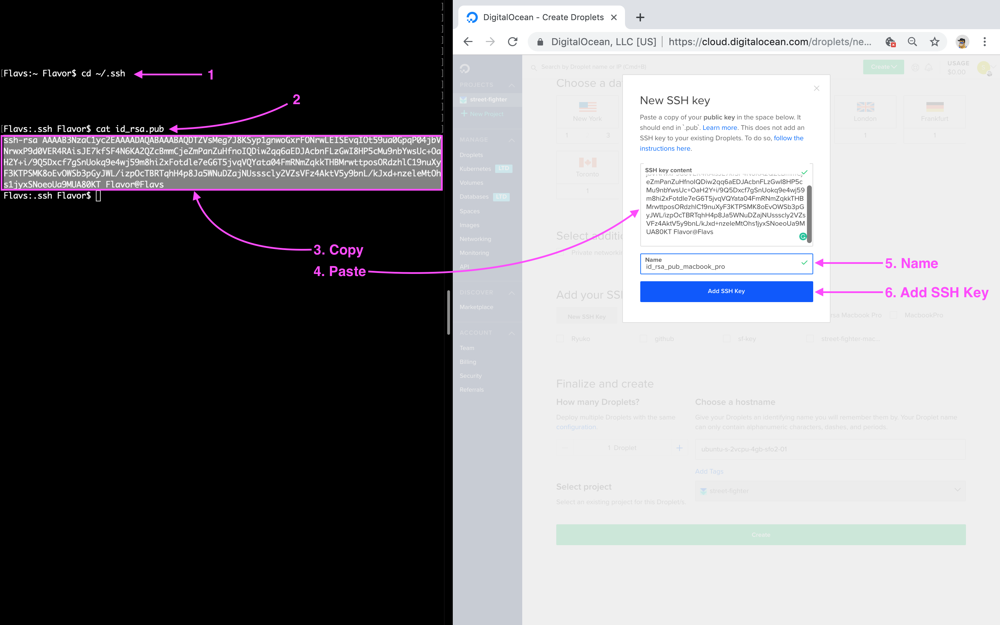
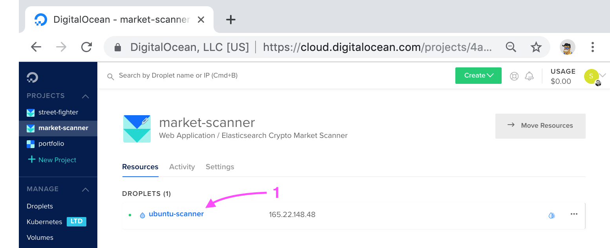

<h1 class='md-title__main'>Deploy an Ubuntu 18.04 Linux Distribution on Digital Ocean</h1>

## Prerequisites

- 1. This guide requires that you [Create New Account on Digital Ocean](https://cloud.digitalocean.com/registrations/new) if you don't have one already.

- 2. After you log into your account you need to [Setup an SSH Key on you MacOS](https://www.youtube.com/watch?v=e69K-sCTpDg) to connect to your new `Ubuntu 18.04 Linux Distribution`.

---

## Create Project

- 1. Click on `New Project` in the left side menu
- 2. Enter project name
- 3. Enter project description
- 4. Select `Web Application` from drop down menu
- 5. Click `Create Project` button to finalize



<br />

## Move Resources

> You can move resources from other projects to this new one, but we will skip this step for now.

- 1. Click `Skip for now`


<br />

## Create Droplet

- 1. Click `Get Started with a Droplet`



<br />

## Ubuntu Distribution

- 1. Click down arrow on the Ubuntu symbol
- 2. Select the `18.04 x64` from the dropdown menu


<br />

## Plan & Backups

- 1. Choose `Standard` plan
- 2. Select the plan that fits your needs and budget
- 3. Add Backups (optional)



<br />

## Data Center

- 1. Choose the Data Center Region closest to you current geographical location


<br />

## SSH Key

> This will allow you to use the `Terminal` to remote login from your Macbook Pro. 

> `Remote login is required` to setup `Elasticsearch`, deploy `Node / React` apps.

> It is also required to <a href='setup-secure-reverse-proxy.html'>Setup Secure HTTPS/SSL Reverse Proxy with Nginx</a>

- 1. Click on the `New SSH Key` button


<br />

## Add SSH Key - Macbook Pro

- 1. In the `Terminal` use the command below to `cd` into the `.ssh` directory

```bash {.copy-clip}
cd ~/.ssh
```

- 2. Use the command below to `Copy` the key to to the `Terminal` output

```bash {.copy-clip}
cat id_rsa.pub
```

- 3. `Select the key` and hit `Cmd + C` to `Copy the key` to the clipboard

- 4. Use `Cmd + V` to `Paste the key` into the `SSH key content` box

- 5. Name the key `id_rsa_pub_macbook_pro`

- 6. Click the `Add SSH Key` button to finalize



<br />
<br />

> This key can now be added to future distributions


<br />


## Finalize and Deploy

- 1. Choose a name
- 2. Click the `Create` button to deploy


<br />

## View Your New Ubuntu 18.04 Linux Distribution

- 1. When the deployment is complete click on the link to view your new distribution



<br />

## Enable Private IP

- 1. Click on the `Networking` link
- 2. Click on the `Enable now` link next to `Private IP`
- 3. When the `Private IP` has been enbaled click on the `IP ADRESS` to `Copy the IP` to the clipboard


<br />

## Remote Login 

1. In the `Terminal` use the command below to Remote Login into your new Ubuntu 18.04 Linux Distribution

> NOTE: Use your Private IP copied from the previous step

```bash {.copy-clip}
ssh root@YOUR_IP_ADDRESS
```

<div class='md-label md-label-output'>You will be asked to verify connection.</div>

```bash {.copy-clip .md-output}
The authenticity of host 'YOUR_IP_ADDRESS (YOUR_IP_ADDRESS)' can't be established.
ECDSA key fingerprint is SHA256:69COxLPNVNt39BqYrl9T7nJ0NJnF15vUi8pqYQ7hWoY.
Are you sure you want to continue connecting (yes/no)? 
```

Type `yes` and hit the `Enter-key`

```bash {.copy-clip}
yes 
```

<div class='md-label md-label-output'>If everything was setup correctly you should now be Remote logged into your new Ubuntu 18.04 Linux Distribution!</div>

```bash {.copy-clip .md-output}
Warning: Permanently added 'YOUR_IP_ADDRESS' (ECDSA) to the list of known hosts.
Welcome to Ubuntu 18.04.2 LTS (GNU/Linux 4.15.0-47-generic x86_64)

 * Documentation:  https://help.ubuntu.com
 * Management:     https://landscape.canonical.com
 * Support:        https://ubuntu.com/advantage

  System information as of Fri Apr 19 18:27:11 UTC 2019

  System load:  0.0               Processes:           90
  Usage of /:   1.2% of 77.36GB   Users logged in:     0
  Memory usage: 3%                IP address for eth0: 'YOUR_IP_ADDRESS'
  Swap usage:   0%

  Get cloud support with Ubuntu Advantage Cloud Guest:
    http://www.ubuntu.com/business/services/cloud

0 packages can be updated.
0 updates are security updates.


The programs included with the Ubuntu system are free software;
the exact distribution terms for each program are described in the
individual files in /usr/share/doc/*/copyright.

Ubuntu comes with ABSOLUTELY NO WARRANTY, to the extent permitted by
applicable law.

root@ubuntu-scanner:~# 
```

## Next Step

You are now ready to <a href='install-java'>Install Java, the JRE & the JDK on an Ubuntu 18.04 Linux Distribution</a>
